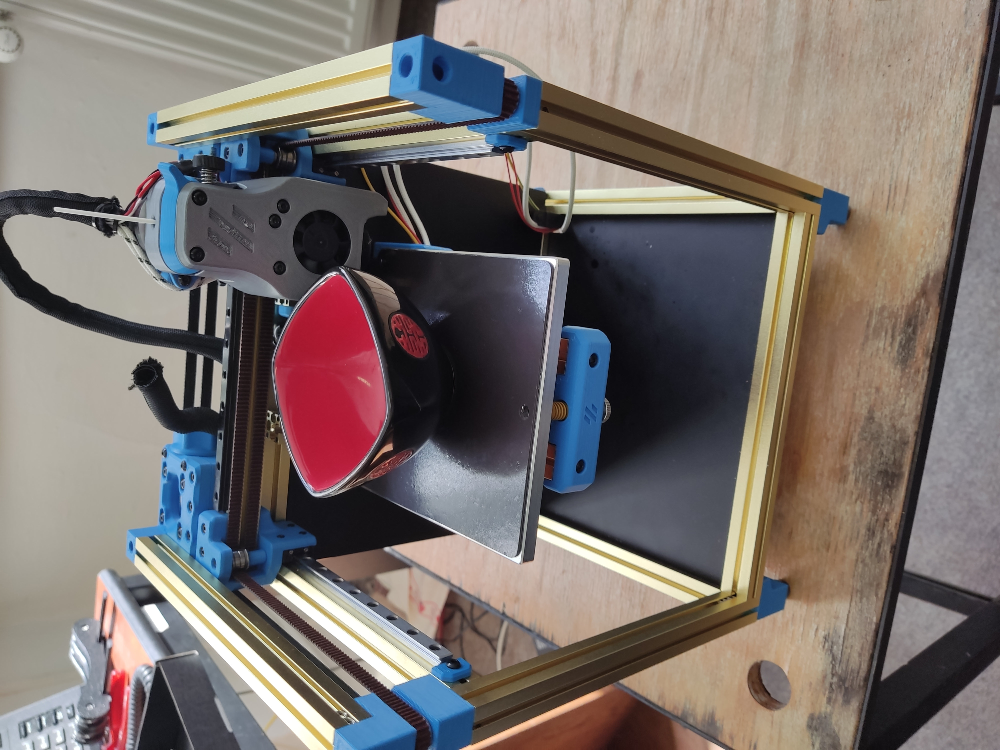
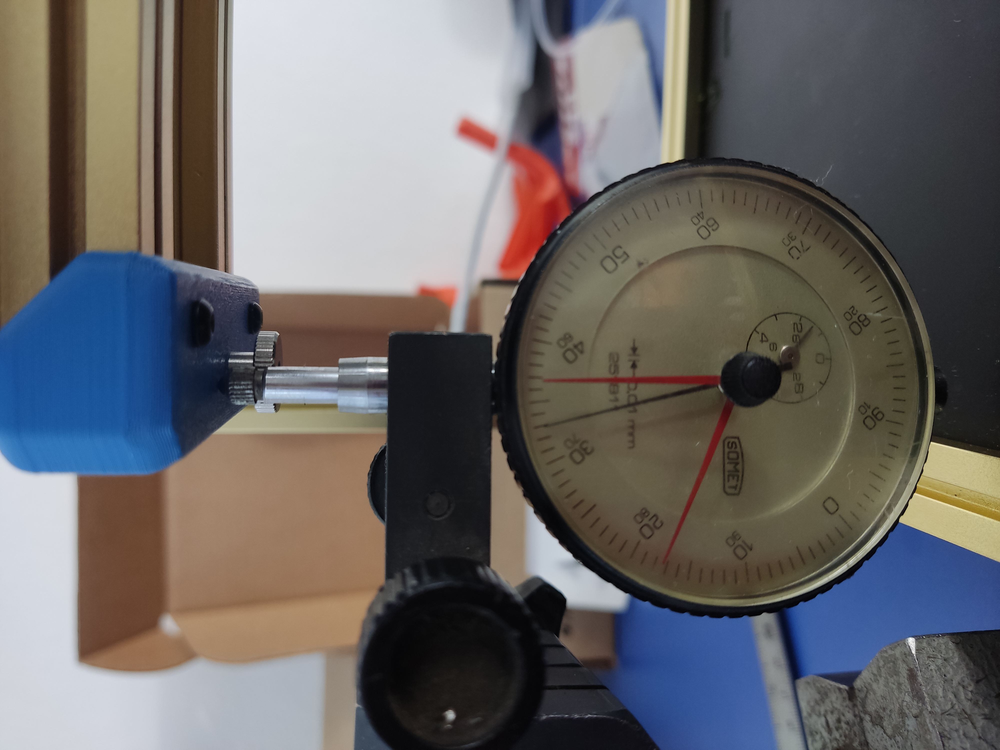

# voron-v01-POM-fix
**Issue: Z motor is binding/skipping at default 0.37A current with empty bed, with properly aligned parts (Z leadscrew and  POM nut T8_Nut_Block plastic part)**
[Youtube Video](https://youtu.be/tI24zk7298Q )

Originally used for LDO v0.1 kit rev C Anti Backlash Nut, POM, Tr8X8, if you got Z binding-skipping on default Z motor current 0.37A, with good Z axis alignment

hm.. increase in Z motor amps to 0.5A-0.55A solve this but at the cost of grinding plastic POM down and potentialy harm other parts of printer (head) as you really dont wanna super strong Z power (imagine Z endstop wont trigger)

**My best practice of aligning Z - before we hop into more unpleasant stuff**
1. fix Z motor (tighten all 4 screws) , bear in mind that you should trigger Z endstop with screw in T8_Nut_Block plastic part, for me it was more on rigth side from front view, POM nut is already on leadscrew
2. fix POM nut in T8_Nut_Block plastic part (tighten 2 screws), while T8_Nut_Block itself is still losen on alu Z profile
3. bring bed down (rotate leadscrew by hand), align T8_Nut_Block plastic part with leadscrew and tighten it (if you have backplate on, there are drilled two holes for wrench)
4. if you are lucky its working if not losen T8_Nut_Block plastic part and find better position.
5. if you are not able to find position without binding and you believe that you are doing everything rigth read next

**WHY this happenign to me?? - spring on POM nut has thick wire, is short, with few "rings" which creating uneven pressure on POM nuts edge, this could create shear force locking nuts into leadscrew, it kills tolerance you need for other small missalignments which always occurs as there is NO way to have Z pefrectly squared**

**Solution1 - relieve spring tention with 3D printed spacer**

 

**Solution2 - spring replacement, use spring with thinner wire and more rings**

Do not use brass nuts on ptfe coated LDO kits leadscrew, it grinds the leadscrew down.

**Conclusion**
With replacement spring or printed spacer its possible for example to move 180g cup up and down on default 0.37A on Z without skipping steps or binding.

It took me 4 whole days to solve this after two complete dissasemblies of printer as I was trying to square it. After spring replacement it worked on frist atttemp. Also printed spacer helped a lot with simmilar results.

**note 1**
I removed dragchain as I had feeling it is binding Z at the top position and I also feed cables from the bed under the bed, as gravity is helping with their binding

**note2**
I even tried to compensate T8_Nut_Block plastic part with bed drop... its 0.3 degree.. I remodeled it... printed... tested...

one of two teardowns

